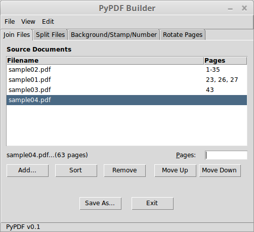

# PyPDF Builder 

A cross-platform utility to join, split, stamp, extract pages, and rotate PDFs written in Python. Yes, Python!

This project is inspired by Angus Johnson's [PDFTK Builder](http://angusj.com/pdftkb/). Its goal is a GUI that builds on [PyPDF2](https://github.com/mstamy2/PyPDF2) as well as other PDF related libraries and offers a unified and simple experience for end-users.

This fork added the page extraction module and fixed minor ui issues (and is only tested) on Mac OS.




## Getting Started

Grab a copy of `virtualenv` or `virtualenvwrapper` and set up a virtual environment with your favorite Python interpreter (see [Prerequisites](#prerequisites)) to separate the dependencies for this project. Then it's the same old same old:

```
git clone https://github.com/mrgnth/PyPDF-Builder.git
pip install -r requirements.txt
```

These instructions will get you a copy of the project up and running on your local machine for development purposes.

### Prerequisites

PyPDF Builder is built on [Tkinter](https://docs.python.org/3/library/tk.html), [Pygubu](https://github.com/alejandroautalan/pygubu) and [PyPDF2](https://github.com/mstamy2/PyPDF2), a pure-python PDF library. Running `pip freeze` should give you something like this:

```
pygubu==0.9.8.2
PyInstaller==3.3.1
PyPDF2==1.26.0
Sphinx==1.7.2
```

... and a whole bunch of related dependencies (especially Sphinx is a doozy!).

Python 3.6 was used in development… I haven't checked for compatibility with lower versions, so your mileage my vary with anything starting 3.5 on downward.


## Deployment

Distributable application for Windows, Linux and Mac OS using [PyInstaller](https://pyinstaller.readthedocs.io/en/stable/):

```
pyinstaller --onefile --clean --windowed --add-data="mainwindow.ui:." \
    --hidden-import="pygubu.builder.ttkstdwidgets" \
    --hidden-import="pygubu.builder.widgets.dialog" \
    pypdfbuilder.py
```

Subsequent builds can be managed by editing the `.spec` file created by the first build and then simply running `pyinstaller pypdfbuilder.spec` to build the executable.

Long term: Inclusion in Debian repos for direct installation on end-user systems.

## License

This project is licensed under the MIT License - see the [LICENSE](LICENSE) file for details

## Acknowledgments

* [Matthew Stamy](https://github.com/mstamy2): Creator and current maintainer of the PyPDF2 Python package
* Angus Johnson: Creator of [PDFTK Builder](http://angusj.com/pdftkb/)

## To Do

- [X] Join Tab Functionality
- [X] Split Tab Functionality
- [X] Refactor to avoid code repetition in save, file info, etc methods
- [ ] User Documentation (mostly self-explanatory)
- [ ] Developer Documentation
- [ ] Write tests
- [ ] Error checking user input
- [ ] Error/Exception Handling
- [ ] Failover to system PDF Tools (e.g. Poppler)
- [X] Stamp/Background/Number Tab
- [X] Rotate Pages
- [X] Menus
- [X] Persistent User Settings
- [ ] Logging
- [ ] Error Reporting?
- [ ] Github Project pages with Nikola
- [ ] Package via pyInstaller
- [ ] Distribution via Releases on GitHub
